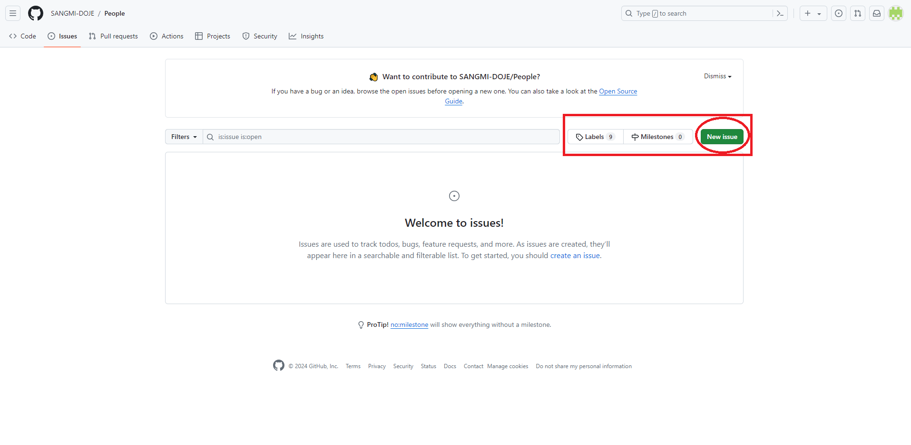

# 리스트에 사람 추가하기

<br><br>


- Issues 탭을 클릭해 해당 페이지로 들어갑니다.
  <br><br><br><br><br>



- 오른쪽 상단의 New issues 버튼을 클릭해 issues 생성 화면으로 들어갑니다.
  <br><br><br><br><br>


```md
- title에는 Ex. Web, Game, Android 등 해당하는 분야 탭을 작성해주시기 바랍니다.
- Ex.| 이름[https://github.com/자신의 깃허브명] | 기수 | 재직상태 | 스킬셋 Ex. Node.js, Python, Scala, Vue.js | 회사명 |
- 재직 상태는 `재직중`, `구직중` 혹은 공란(재학생)으로 작성해 주세요
```

<br><br><br><br><br>

- 이슈 생성 후 빠른 시일내에 추가해드리겠습니다.
- 추가 안될시 **myucheu0617@gmail.com** 로 연락 주시면 추가해드리겠습니다.
